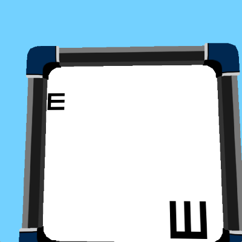
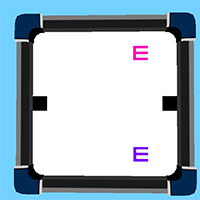
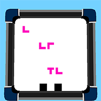
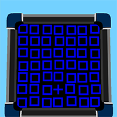
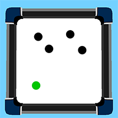
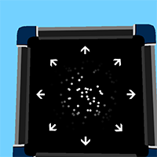

# oculoenv
Oculomotor task environments. [version 0.1.0]

Task contents are mostly compatible with [Psychlab](https://arxiv.org/abs/1801.08116).

## Tasks

### Point to taget



The agent is required to move the gaze point to the target (small or large E) with avoinding the lure object (small or large rotated E).

### Change detection



The agent is required to detect whether the combination of objects are changed after the blank period. If objects are changed agent should choose left black target and otherwise should choose right.

### Visual search



The agent is required to detect whether there is magenta T shape on the screen or not.
If there is, the agent should choose right bottom black target and otherwise left bottom one.

### Odd one out



The agent is required to move the gaze point to the target which has different property from others (color, shape or movement).

### Multiple object tracking



The agent should answer whether the last blue dot has started as green or not.
If yes, the agent should choose right bottom black target and otherwise left bottom one.

### Random dot motion discrimination



The agent is required to detect the direction of the moving dots while some portion of the dots has non-coherent random movement. The agent should answer the direction by moving the gaze point to the arrow objects.

# Install

### Python3

```
$ pip3 install oculoenv
```

### Python2

```
$ pip install oculoenv
```

# Example

```python
import numpy as np
from oculoenv import PointToTargetContent, Environment

content = PointToTargetContent()
env = Environment(content)

for i in range(100):
    dh = np.random.uniform(low=-0.02, high=0.02)
    dv = np.random.uniform(low=-0.02, high=0.02)
    action = np.array([dh, dv])
    obs, reward, done, _ = env.step(action)

    if done:
        print("Episode terminated")
        obs = env.reset()
        
    image = obs['screen']
```


# Acknowledements

Some of the Opengl related code fragments are from [gym-duckietown](https://github.com/duckietown/gym-duckietown/).

